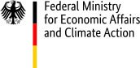

[](https://codecov.io/gh/JuliaEnergy/PowerDynamics.jl)
[](https://juliaenergy.github.io/PowerDynamics.jl/stable/)
[](https://juliaenergy.github.io/PowerDynamics.jl/dev/)

PowerDynamics.jl: An Open-Source Framework Written in Julia for Dynamic Power Grid Modeling and Analysis. [Please check out the Docs.](https://juliaenergy.github.io/PowerDynamics.jl/stable/)

> [!IMPORTANT]
> In Q2/2024 we started a complete rewrite of PowerDynamics.jl, which is much closer aligned to the modern SciML-Stack, heavily leaning on [ModelingToolkit.jl](https://github.com/SciML/ModelingToolkit.jl) for equation based models and a vastly modernized version of our backend, [NetworkDynamics.jl](https://github.com/JuliaDynamics/NetworkDynamics.jl)
> The new PowerDynamics improved significantly in terms of modeling, initialization and solution analysis. However, some models and tools previously available are not yet avilable. If you've want to continue using the (unmaintained) old version, stick with PowerDynamics@v3.

## Citation

If you use PowerDynamics.jl in your research publications, [please cite our paper](https://www.sciencedirect.com/science/article/pii/S2352711021001345).

```latex
@article{PowerDynamics2022,
  title={PowerDynamics.jl--An experimentally validated open-source package for the dynamical analysis of power grids},
  author={Plietzsch, Anton and Kogler, Raphael and Auer, Sabine and Merino, Julia and Gil-de-Muro, Asier and Li{\ss}e, Jan and Vogel, Christina and Hellmann, Frank},
  journal = {SoftwareX},
  volume = {17},
  pages = {100861},
  year = {2022},
  publisher={Elsevier}
}
```

## Funding
Development of this project was in part funded by the *German Federal Ministry for Economic Affairs and Climate Action* as part of the *OpPoDyn*-Project ([Project ID 01258425/1](https://www.enargus.de/pub/bscw.cgi/?op=enargus.eps2&q=%2201258425/1%22), 2024-2027).


