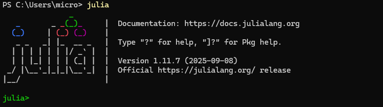
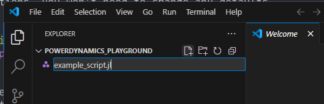
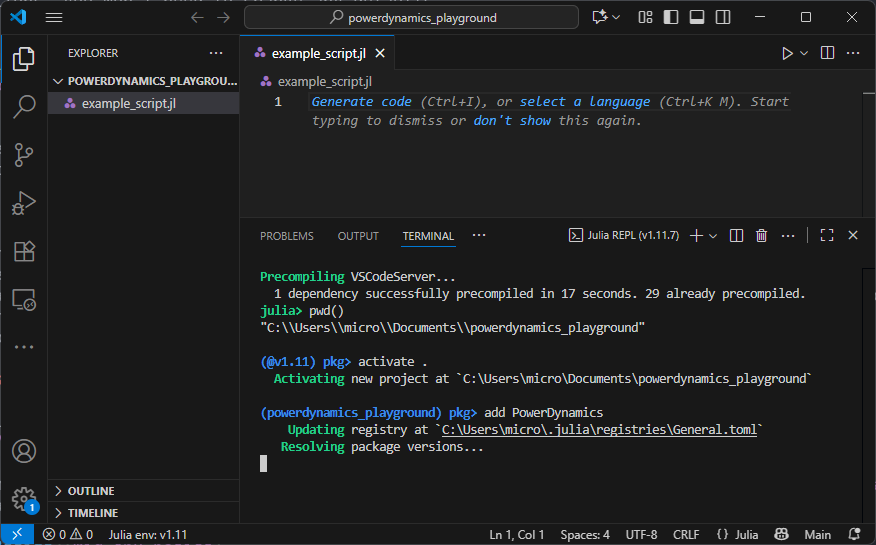
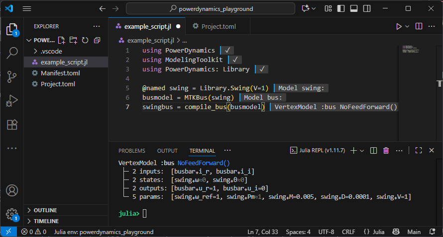

# [Part I: Julia Setup for PowerDynamics](@id julia-setup)

This is the first part of a three-part introduction aimed at new colleagues and collaborators
who want to use PowerDynamics.jl. It assumes no prior Julia experience.

- **Part I (this document):** install Julia, set up VSCode, run your first model.
- **[Part II: Environments and Package Management](@ref env-management):** how packages, versions and environments actually work.
- **[Part III: Structuring Research Projects](@ref research-projects):** how to grow from a single script into a maintainable research codebase.

If you've worked with Julia before, you can probably skim Part I and jump to the [getting started tutorial](@ref getting-started).

We also recommend further resources, like the excellent
- community-provided [Modern Julia Workflows blog](https://modernjuliaworkflows.org/) and the
- [official Julia documentation](https://docs.julialang.org).

## Install Julia
First you need to install Julia.
Check out the [install instructions](https://julialang.org/install/) on the official Julia homepage.
It is recommended to install Julia using **juliaup**.

!!! note
    [juliaup](https://github.com/JuliaLang/juliaup) is a Julia version multiplexer; you can use it to *manage* different Julia versions on the same system
    using commands like `juliaup update` (update installed versions), `juliaup add 1.11` (add a new version), `juliaup default 1.11` (tell your computer which version to start when you invoke the `julia` command).

In general, Julia can be installed and run without any administrator privileges.

### Windows

You can install Julia on Windows using the Microsoft Store. Instead of searching manually, you can invoke this installation in the terminal.
Search for `powershell` in the start menu and execute
```bash
winget install --name Julia --id 9NJNWW8PVKMN -e -s msstore
```

### Linux/Mac
Execute the following code in your terminal:
```bash
curl -fsSL https://install.julialang.org | sh
```

The installer will ask you some questions, you won't need to change any defaults.

### Verify installation
After the installation, run the `julia` command in your terminal. You should get an output like this:



## The Julia REPL
Julia's main interface is the REPL (read-eval-print-loop). It is similar to `ipython` or the Matlab command window.
You can execute code in the REPL by typing it. Try `julia> println("hello world")<RETURN>` to run your first Julia command.
Exit the REPL by pressing `CTRL + d` or typing `exit()<RETURN>`.

!!! tip
    The REPL has lots of great features. For example:
    - hit `]` to enter package manager mode (see [Environment Basics](@ref env-basics) below)
    - hit `?` to enter help mode: search for functions or concepts to get documentation
    - hit `;` to enter shell mode for one-off shell commands
    - scroll through history using arrow up and arrow down

## Install VSCode with the Julia extension
The REPL is great, but we also need an editor for writing code.
The best editor for most people will be [Visual Studio Code](https://code.visualstudio.com/).
Please [download and install](https://code.visualstudio.com/Download) it.

Within VSCode, you need to install the [julia-extension](https://marketplace.visualstudio.com/items?itemName=julialang.language-julia).
You should be able to click the "install" link in any browser, it'll open VSCode and install the extension.
Alternatively, you can search for "Julia" in the VSCode extension store.

## [Environment Basics](@id env-basics)

Julia has a built-in package manager that lets you install and manage dependencies *per project*.
Different projects often need different packages — and different *versions* of the same package.

This section gives you the bare minimum to get you up and running.
For a deeper understanding of why environments matter, what `Project.toml` and `Manifest.toml` actually do,
and how to use the package manager properly, see [Part II](@ref env-management).

!!! note "Why per-project environments?"
    Imagine you have a research project A using `PowerDynamics` at version `v1.0.0` — it works great.
    Now you want to start a new project B which requires a feature introduced in `v2.2.0`!
    Per-project environments let you use `v1.0.0` in A and `v2.2.0` in B without one breaking the other.

To create your first environment, create a new folder somewhere (for example `~/Documents/powerdynamics_playground`).
Open this empty folder in VSCode and create a new file for your first script:



Open the newly created file, hit `CTRL + SHIFT + P` to bring up the VSCode "command palette", search for "Start REPL"
and launch your Julia REPL.

In the REPL, you can execute `pwd()` (print working directory) to see the directory where your REPL was launched.
Hit `]` to launch the package manager. Your REPL prompt changes:
```julia-repl
(@v1.11) pkg>
```
This output means your *active* environment is the global environment for Julia `v1.11`.
If you were to add packages here, you would add them globally — generally not what you want.
So instead we activate the current folder (`.`) as our working environment:
```julia-repl
(@v1.11) pkg> activate .
```
After activation, we can add `PowerDynamics` to our newly created environment using
```julia-repl
(powerdynamics_playground) pkg> add PowerDynamics
```
This will install PowerDynamics and all its dependencies, and precompile all of them. This may take a while...



Once you've added a package, you'll see two new files: `Project.toml` and `Manifest.toml`.
The `Project.toml` lists your *top-level* dependencies — this is the file you change when adding new packages.
The `Manifest.toml` is a complete snapshot of every package in the environment with exact versions, including transitive dependencies. **Never edit it by hand.**
```
ProjectRoot
├╴example_script.jl
├╴Project.toml
╰╴Manifest.toml
```
The existence of a `Project.toml` file marks a folder as a *project* you can *activate*.
When executing code in a file using the Julia VSCode extension, it will automatically activate the environment for you, **provided** you tell VSCode which environment to use.

!!! tip "Pick the environment in VSCode"
    Look for the small `Julia env: ...` indicator in the bottom-left status bar of VSCode.
    Click it to choose your project folder as the active environment.
    Doing this *before* starting the REPL avoids a class of subtle problems explained in [Part II](@ref start-in-project).

## Executing Code in VSCode
Working with Julia is much like working in a notebook (Jupyter, Colab or similar), thanks to the persistent REPL.
Because of how Julia works internally, everything will take much more time the first time you do it.
Therefore, it is always preferred to have a **persistent REPL** over relaunching Julia. That is:
1. open a REPL,
2. execute a script in the REPL,
3. change the script,
4. run the script again in the same REPL

is much preferred to
1. executing the script via `julia myscript.jl`,
2. changing the script,
3. executing it again via `julia myscript.jl`,

in which case you'd pay the startup costs on every new run.

Besides executing an entire script (play button up top), you can execute **single lines** and **code blocks** in VSCode:
- Put the VSCode cursor on a line and hit `SHIFT + RETURN` to "send" that line of code to the REPL. If the line is part of a multiline expression (like a function), it'll send the entire block.
- Select multiple lines and hit `SHIFT + RETURN` to send all selected lines.
- Hit `ALT + RETURN` (or `CMD + RETURN`) to execute an entire *code cell*, where a code cell is everything between lines starting with `##`.

!!! note "Execute your first script"
    Install `ModelingToolkit` in addition to `PowerDynamics` in your environment and copy the following code to your script:
    ```julia
    using PowerDynamics
    using ModelingToolkit
    using PowerDynamics: Library

    @named swing = Library.Swing(V=1)
    busmodel = MTKBus(swing)
    swingbus = compile_bus(busmodel)
    ```
    Execute it line by line using `SHIFT + RETURN` and enjoy your first bus model!

    

## Running PowerDynamics Examples
Now you know everything you need to know to run our examples locally.

At the beginning of each example, there is a link:

> This tutorial can be downloaded as a normal Julia script here.

Go to the [getting started](@ref getting-started) tutorial, download the script, put it in your
directory and go through it, executing it block by block.

!!! tip
    For most scripts to work you need to install additional packages.
    You can install multiple packages at once:
    ```julia-repl
    julia> ] add OrdinaryDiffEqRosenbrock, CairoMakie
    ```

## Next Steps
You now have a working Julia setup and can run our examples. From here:

- **[Part II: Environments and Package Management](@ref env-management)** explains what's actually happening when you run `add`, `update` or `instantiate`, why versions matter, and how to avoid a few common pitfalls. It also introduces [Revise.jl](https://github.com/timholy/Revise.jl) — a tool you'll want from day one.
- **[Part III: Structuring Research Projects](@ref research-projects)** is for when your single script grows into something bigger and you want to organize your code, share it with collaborators, and keep your work reproducible.

You don't have to read them in order, but reading them in order is probably the gentlest path.
